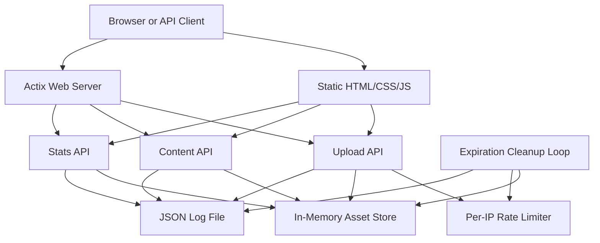

# Block Diagram

```mermaid
flowchart TD
    Client[Browser or API Client]
    Static[Static HTML/CSS/JS]
    Server[Actix Web Server]
    Upload[Upload API]
    Content[Content API]
    Stats[Stats API]
    Store[In-Memory Asset Store]
    Limit[Per-IP Rate Limiter]
    Cleanup[Expiration Cleanup Loop]
    Logs[JSON Log File]

    Client --> Static
    Client --> Server
    Static --> Upload
    Static --> Content
    Static --> Stats

    Server --> Upload
    Server --> Content
    Server --> Stats

    Upload --> Limit
    Upload --> Store
    Upload --> Logs
    Content --> Store
    Content --> Logs
    Stats --> Store
    Stats --> Logs
    Cleanup --> Store
    Cleanup --> Limit
    Cleanup --> Logs
```
